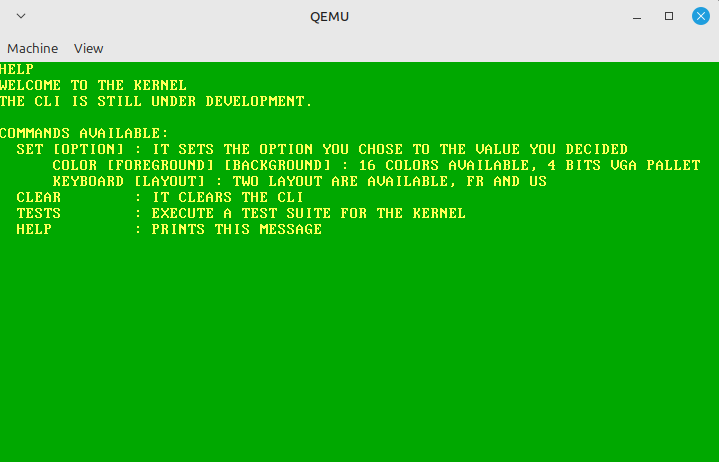

# Kernel From Scratch

KFS is a kernel for study purposes. It is the first kernel I write. Be indulgent.

## Installation

Once you cloned the repository, download a [cross-toolchain]() of your choice for the i386 architecture.
I use QEMU (qemu-system-i386)as an emulator for the architecture. 

```bash
mv <TOOLCHAIN> gcc_kfs
make
```

## Features

Current features available:
- Global Descriptor Table
- Interrupt Descriptor Table
- PIC driver
- Keyboard driver (supports AZERTY and QWERTY)
- VGA driver (supports 16 colors)
- Basic libc
- CLI

## Usage

The following command will compile the ELF binary the and link it grub to build the ISO if it was not yet done.
It will lauch qemu with the kfs.iso at the root of the repository.

```bash
make qemu
```

The kernel's CLI has a helper function HELP that prints the following to the screen:



## Contributing

Even tho the project is for study purpose, pull requests are welcome.
For major changes, please open an issue first to discuss what you would like to change.

Please make sure to update tests as appropriate.
