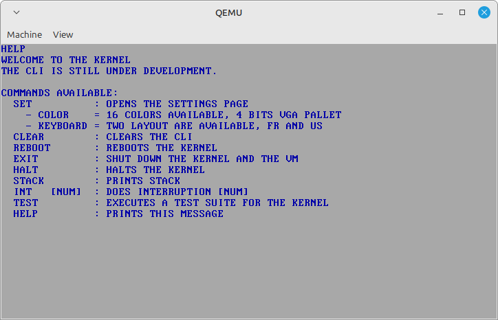

# Kernel From Scratch

KFS is a kernel for study purposes. It is the first kernel I write. Be indulgent.

## Installation

Once you cloned the repository, you can download a cross-toolchain of your choice for the i386 architecture but I wrote a short script that will do everything for you.
I use QEMU (qemu-system-i386) as an emulator for the architecture. 

```bash
./build.sh
```

## Features

Current features available:
- Higher-Half Kernel
- Global Descriptor Table
- Interrupt Descriptor Table
- PIC driver
- Keyboard driver (supports AZERTY and QWERTY)
- VGA driver (supports 16 colors)
- Basic libc
- CLI
- Paging enabled
- Physical Memory Manager
- Virtual Memory Manager
- Kmalloc, Kfree (binning allacator for allocations smaller than 0x800 bytes, simple cache for larger ones)
- Base for ABI syscall implementation with IDT

## Usage

The following command will compile the ELF binary the and link it GRUB to build the ISO if it was not done yet.
It will lauch qemu-system-i386 with the kfs.iso at the root of the repository.
If you only wish to complie then a simple make will do.

```bash
make qemu
```

The kernel's CLI has a helper function HELP that prints all available commands:



## Contributing

Even tho the project is for study purpose, pull requests are welcome.
For major changes, please open an issue first to discuss what you would like to change.

Please make sure to update tests as appropriate.
